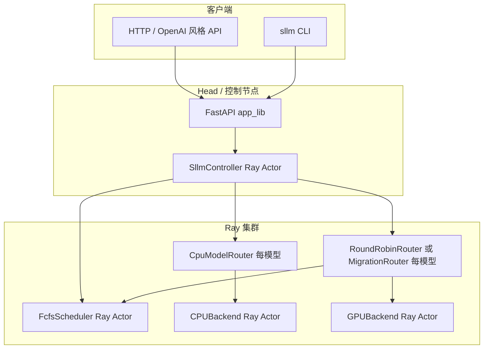

# Relayserve / SLLM 系统说明

本文说明本仓库中 **ServerlessLLM（`sllm`）推理控制面** 的组成、典型运行流程与基本用法。实现入口主要在 `sllm/` 目录。

---

## 1. 系统组成

### 1.1 总体架构

系统运行在 **Ray 集群** 之上：控制面 Actor 与推理 Worker Actor 均由 Ray 调度到具体节点；对外通过 **FastAPI（Uvicorn）** 提供 HTTP 接口。



### 1.2 核心组件

| 组件 | 说明 | 典型位置（代码） |
|------|------|------------------|
| **Controller**（`SllmController`） | 模型注册、推理入口、冷启动编排；持有各模型的 CPU/GPU Router 句柄 | `sllm/controller.py` |
| **FcfsScheduler** | GPU 资源排队分配、实例登记、冷启动按节点串行化、负载相关辅助 | `sllm/schedulers/fcfs_scheduler.py` |
| **CpuModelRouter** | 每模型一个 CPU 侧路由；启动 CPU 推理 Actor，拉取 SHM/KV 布局供 GPU 对齐 | `sllm/routers/cpu_router.py` |
| **RoundRobinRouter** / **MigrationRouter** | GPU 实例池、负载均衡、与调度器交互申请 GPU、启动 GPUBackend | `sllm/routers/roundrobin_router.py`、`migration_router.py` |
| **CPUBackend / GPUBackend** | 实际推理后端（当前集成路径以 vLLM 风格为主） | `sllm/backends/cpu_backend.py`、`gpu_backend.py` |
| **start_instance** | Ray 远程函数：在指定资源约束下创建 Detached Backend Actor | `sllm/routers/router_utils.py` |
| **HTTP 服务** | 健康检查、注册/更新/删除模型、聊天补全 | `sllm/app_lib.py` |

### 1.3 Ray 资源与节点角色（多机时）

- **控制节点**：通常声明 `control_node` 自定义资源；Controller、Scheduler、Router 等可调度到该资源上。
- **Worker 节点**：GPU Worker 在 Ray 上应声明 **`worker_node`** 与 **`gpu_worker_<N>`**（与 `entrypoint.sh` 一致）；纯 CPU Worker 可声明 **`cpu_worker_<N>`**。调度器与 Actor 放置均按该命名约定（见 `sllm/utils.py` 中 `get_worker_nodes`、`ray_*_placement_resources`）。

### 1.4 与分布式推理其它目录的关系

- `distributed_inference/`：偏研究/另一套分布式推理与迁移脚本，与 `sllm/` 控制面可并存于同一仓库；日常「一键起服务」以 **`sllm` CLI + Ray** 为主。

---

## 2. 运行流程

### 2.1 启动服务（Head）

1. 确保已 `ray start`（多机时 Worker 加入同一地址）。
2. 执行 **`sllm start`**（见下文「使用方法」）：内部 `ray.init()`（若未初始化）、创建 **`controller`** Ray Actor 并调用 `controller.start()`、启动 **FcfsScheduler**，最后 **Uvicorn** 监听 HTTP 端口。

### 2.2 注册模型（`register`）

对每个 `model_name`：

1. 创建 **`CpuModelRouter`**（namespace `cpu_models`）与 **`RoundRobinRouter`**（或开启迁移时的 `MigrationRouter`，namespace `gpu_models`）。
2. **先** `cpu_router.start()`：拉起 CPU Backend，探测并缓存 SHM/KV 相关信息。
3. **再** `gpu_router.start()`：按 `auto_scaling_config` 预创建/扩容 GPU 实例等（具体逻辑见 Router 实现）。

注册完成后，Controller 在元数据中记录该模型及两个 Router 的句柄。

### 2.3 推理请求（`generate_stream` 热路径与冷启动）

1. **Tokenizer** 计算 prompt 长度，写入 `request_data["input_length"]`。
2. 若 GPU Router 报告 **已有加载完成的实例**（`has_loaded_instance`）：请求直接进入 **GPU 推理**。
3. 否则进入 **冷启动路径**：
   - 通过 Scheduler 查询 **该模型是否已有 GPU 节点**、**同节点是否已有冷启动在进行**（可 **piggyback** 复用）。
   - 必要时 **`wait_cold_start_ready`**，避免同节点多模型冷启动资源争抢。
   - 从 CPU Backend 读取 **`get_shm_kv_cache_info`**，并同步到 GPU Router（保证 SHM 等参数一致）。
   - 按策略 **tokenwise** 或 **layerwise**：触发 GPU `lazy_load_weights`、CPU 侧可选并发生成等（详见 `controller.py` 分支）。

### 2.4 GPU 实例放置（调度器侧摘要）

- **FcfsScheduler** 的控制循环从 `get_worker_nodes()` 拉取当前集群 GPU Worker 视图，按队列 FCFS 满足待分配的加载请求。
- **同模型扩容**时，实现上会 **优先** 在已运行该模型实例的逻辑节点上再申请 GPU（便于同机多实例与局部性）；详见调度器中「colocate」排序逻辑。
- Router 在拿到 `node_id` 后，通过 **`ray_gpu_actor_placement_resources`** 生成 Ray `resources`，将 GPUBackend Actor **钉**到对应 Worker 资源上。

### 2.5 CPU 实例放置（可选）

- **手动指定**：在 **`backend_config`** 中配置 **`cpu_placement_resources`**（完整 Ray `resources` 字典），或仅配置 **`cpu_placement_node_id`**（字符串，如 `"1"`）→ 固定使用资源键 **`cpu_worker_<id>`**。逻辑编号写入 `InstanceHandle.node_id`，与调度器里 GPU 的 **`gpu_worker_<id>`** 使用同一套编号可对齐同机（见 `ray_cpu_actor_placement_resources`）。
- **未指定时的轮询**：未设置 **`cpu_placement_resources`** 且未设置 **`cpu_placement_node_id`** 时，若 Ray 上存在 **`cpu_worker_*`** 资源，则 **`SllmController`** 在每次 `register` 时按 **round-robin** 分配（**`discover_cpu_worker_placement_keys`**）；否则回退为仅 **`worker_node`** 的 Ray 默认调度。
- **关闭轮询**：设置 **`cpu_placement_disable_round_robin`: true** 可强制走 `worker_node`，即便集群上存在 `cpu_worker_*` 资源。

---

## 3. 使用方法

### 3.1 环境前提

- Python 环境与项目依赖已安装（参见仓库根目录 `README.md` 与官方文档）。
- **Ray 集群** 已配置自定义资源：头节点 **`control_node`**；GPU Worker 通常为 **`worker_node`** 与 **`gpu_worker_<N>`**；可选专用 CPU Worker 为 **`cpu_worker_<N>`**（与代码中固定命名一致）。

### 3.2 启动 HTTP 控制与推理网关

```bash
# 默认 0.0.0.0:8343；需要迁移能力时加 --enable-migration
sllm start --host 0.0.0.0 --port 8343
```

等价逻辑：启动 FastAPI 应用 + 创建 `controller` Actor 并 `start()`。

### 3.3 部署模型（CLI）

使用 **`sllm deploy`**，可通过 **`--config`** 指定 JSON，也可用命令行覆盖部分字段：

```bash
sllm deploy --config /path/to/model.json
# 或
sllm deploy --model meta-llama/Llama-3.2-1B-Instruct --backend vllm --num-gpus 1
```

默认配置模板见 **`sllm/cli/default_config.json`**。部署请求会发到本机 HTTP 服务的 **`POST /register`**（由 CLI 内部 `requests` 调用，见 `_cli_utils.py`）。

常用字段摘要：

- **`model`**：模型名（HuggingFace id 或本地路径，取决于后端配置）。
- **`backend`**：如 `vllm`。
- **`num_gpus`**、**`tensor_parallel_size`** / **`pipeline_parallel_size`**：并行与卡数。
- **`auto_scaling_config`**：实例数上下限、指标、保活等。
- **`backend_config`**：dtype、lazy_load、SHM 相关、`ray_*` 放置参数、`cpu_*` 放置参数等。

### 3.4 HTTP API（与 OpenAI 接近的入口）

服务启动后（默认端口 **8343**）：

| 方法 | 路径 | 说明 |
|------|------|------|
| GET | `/health` | 健康检查 |
| POST | `/register` | 注册模型（body 为模型 JSON） |
| POST | `/update` | 更新模型配置 |
| POST | `/delete` | 删除模型 |
| POST | `/v1/chat/completions` | 推理；body 需含 **`model`**、**`prompt`**（或兼容字段，以后端为准） |
| GET | `/v1/models` | 列出已注册模型状态 |

推理示例（需按实际模型名修改）：

```bash
curl -s http://127.0.0.1:8343/v1/chat/completions \
  -H "Content-Type: application/json" \
  -d '{"model": "meta-llama/Llama-3.2-1B-Instruct", "prompt": "Hello"}'
```

### 3.5 其它 CLI

```bash
sllm status     # 查看已部署模型
sllm delete MODEL_NAME ...
```

### 3.6 配置中与放置相关的键（多机扩展）

在 **`backend_config`** 中可选设置（默认值见 `default_config.json`）：

- **`preferred_pp0_node_id`**（`backend_config`）：仅作校验提示。当 **`pipeline_parallel_size` > 1** 时，调度器里的 **`preferred_pp0_node_id`** 会在注册阶段 **在 CPU 实例启动之后** 自动设为 **该模型 CPU 实例的 `node_id`**（与 `cpu_worker_<id>` 一致）。若你在配置里写的值与该 CPU `node_id` 不一致，会打 **warning** 并 **仍以 CPU 为准**；未部署到带 `node_id` 的 CPU（例如仅 `worker_node`）时不会设置该项。
- **`ray_placement_include_worker_node`**：是否在 GPU Actor 上同时要求 `worker_node` 资源；GPU 与调度器对齐的键固定为 **`gpu_worker_<node_id>`**。
- **`cpu_placement_node_id`**：指定 CPU 实例落在 **`cpu_worker_<id>`** 上（与 Ray 资源名一致）。
- **`cpu_placement_resources`**：直接给出 CPU Actor 的完整 `resources` 字典（覆盖上述约定时的兜底方式）。
- **`cpu_placement_disable_round_robin`**：为 `true` 时禁用「未指定则按 `cpu_worker_*` 轮询」行为。

---

## 4. 相关文件索引

| 用途 | 路径 |
|------|------|
| 控制与推理编排 | `sllm/controller.py` |
| HTTP 路由 | `sllm/app_lib.py` |
| CLI 入口 | `sllm/cli/clic.py`、`sllm/cli/_cli_utils.py` |
| 默认部署 JSON | `sllm/cli/default_config.json` |
| 集群入口脚本示例 | `entrypoint.sh` |
| 节点枚举与 Ray 放置辅助 | `sllm/utils.py` |

更完整的安装与官方部署说明仍以 **[ServerlessLLM 文档](https://serverlessllm.github.io)** 与仓库根目录 **`README.md`** 为准；本文聚焦本仓库内 **控制面组成与运行主线**。
